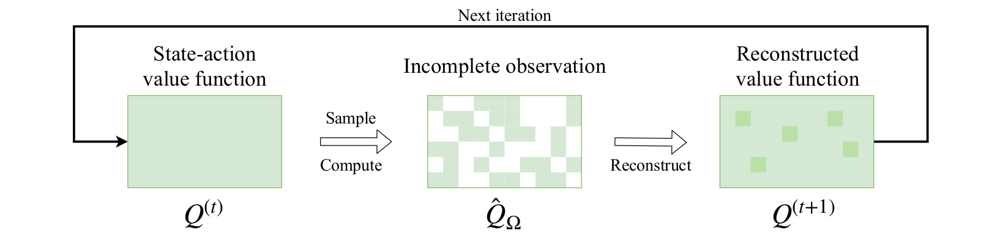
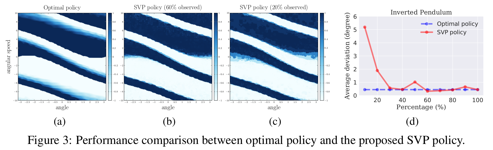
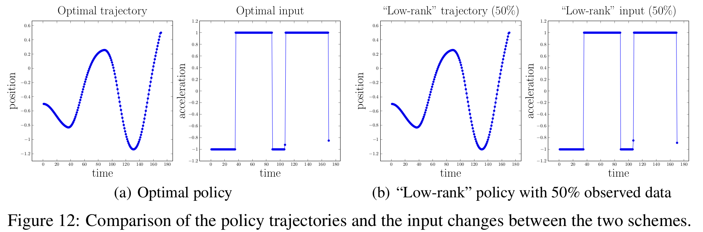
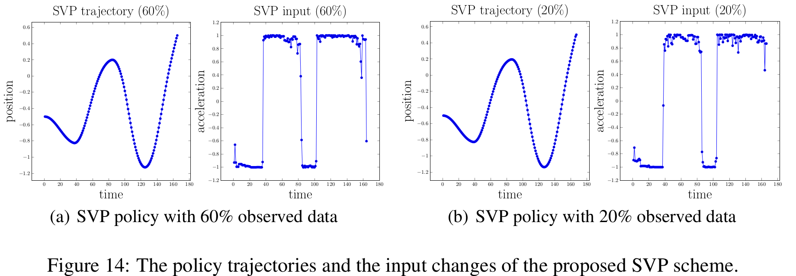

# Structured Value-based Planning (SVP)

We provide implementations for four classical problems, the Inverted Pendulum, the Mountain Car, the Double Integrator, and the Cart-Pole. For the first three problems, the state space dimension is 2; while for the Cart-Pole problem, the state space dimension is higher, with 4 dimensions.
Note that for different problems, the sizes of state/action space discretization may vary, which can be modified in [`MDP.jl`](https://github.com/YyzHarry/SV-RL/blob/master/svp/MDPs.jl).

**Note:** Since we call Python (for the matrix estimation algorithms) from Julia, you will need to install the [`PyCall`](https://github.com/JuliaPy/PyCall.jl) package, and also place the `fancyimpute` folder in your Python `site-packages` directory.
Solutions for common problems (such as import errors) can be found [here](https://github.com/JuliaPy/PyCall.jl).

## Running Examples
For each problem (take `Cart-Pole` as an example):
- Set the desired state & action dimensions as well as observation probability in [`MDP.jl`](https://github.com/YyzHarry/SV-RL/blob/master/svp/MDPs.jl)
- Define the dynamics and reward function in [`CartPole.jl`](https://github.com/YyzHarry/SV-RL/blob/master/svp/CartPole.jl)
- Follow steps in [`CartPole.ipynb`](https://github.com/YyzHarry/SV-RL/blob/master/svp/CartPole.ipynb) for SVP running and visualization

## Representative Results

### Policy heatmap & metric comparison between optimal & SVP policy

### Policy trajectory & input comparison between optimal & SVP policy

